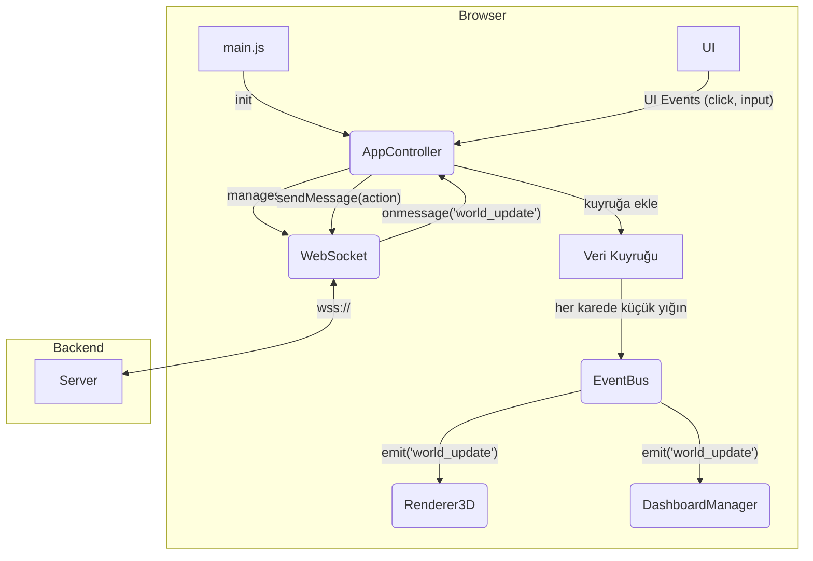

# Sistem Mimarisi v17.1

Bu doküman, NeoMag simülasyon platformunun hem backend hem de frontend mimarisini, bileşenler arası veri akışını ve operasyonel standartlarını detaylandırmaktadır.

| Teknoloji | Versiyon/Standart | Notlar |
| --- | --- | --- |
| Three.js | `0.166.1` | 3D render motoru |
| FastAPI | `0.111.1` | Backend API framework'ü (Python) |
| Docker | `20.10+` | Konteynerleştirme (opsiyonel) |
| Uvicorn | `0.30.3` | ASGI sunucusu |
| WebSocket API | `Browser Standard` | RFC 6455 tabanlı standart tarayıcı API'si |
| Plotly.js | `2.33.0` | Grafik ve veri görselleştirme kütüphanesi |

---

## 1. Frontend Mimarisi

Frontend, modüler ve olay tabanlı (event-driven) bir yaklaşımla tasarlanmıştır. Bu yapı, bileşenlerin birbirine olan bağımlılığını azaltır (decoupling) ve sistemin daha kolay geliştirilip bakımının yapılmasına olanak tanır.

### Ana Bileşenler ve Sorumluluk Ayrımı

*   **`main.js` (Giriş Noktası):** Uygulamanın yaşam döngüsünü başlatır. Sadece `AppController`'ı ilklendirir.
*   **`AppController.js` (Merkezi Kontrolcü):**
    *   **Sorumlulukları:** WebSocket bağlantı yönetimi (reconnect, heartbeat), sunucu ile iletişim ve tüm alt sistemlerin (`Renderer3D`, `DashboardManager`) orkestrasyonu. UI'dan gelen olayları dinler ve sunucuya komutlar gönderir.
    *   **Veri Akışı:** Gelen WebSocket verilerini işler ve bir kuyruk mekanizması üzerinden `EventBus`'a yavaş yavaş (throttling) dağıtır.
*   **`EventBus.js` (Olay Yolu):** "Publish-Subscribe" deseni ile bileşenler arası dolaylı iletişimi sağlar. `AppController`'dan gelen verileri `Renderer3D` ve `DashboardManager` gibi dinleyicilere dağıtır.
*   **Sistemler (`Renderer3D.js`, `DashboardManager.js`):**
    *   `EventBus`'a abone olarak kendilerini güncelleyen, kendi işlevlerinden sorumlu modüllerdir.
    *   `Renderer3D`: `three.js` sahnesini, `InstancedMesh` kullanarak verimli bir şekilde render eder.
    *   `DashboardManager`: `Plotly.js` grafiklerini oluşturur ve günceller.

### Veri Akış Diyagramı (Sadeleştirilmiş)

---

## 2. Backend Mimarisi

Backend, FastAPI kullanılarak asenkron ve ölçeklenebilir bir yapıda tasarlanmıştır.

### 2.1. Performans & Ölçeklenebilirlik

*   **Spatial Partitioning (Quadtree):** Simülasyon içerisindeki ajan ve yiyecek gibi nesneler arası etkileşimler, O(n²) karmaşıklığından kaçınmak için her `update` döngüsünde bir **Quadtree** veri yapısına eklenir. Yakın nesne sorguları (örn: bir ajanın görüş alanındakiler), bu Quadtree üzerinden O(log n) karmaşıklığında verimli bir şekilde yapılır.
*   **Asenkron Görevler (Microservis Ayrımı):**
    *   Yoğun hesaplama gerektiren işlemler (örn: jenerasyonlar arası istatistiksel analiz) ana API thread'ini bloklamamak için **Celery worker**'larına devredilir.
    *   `redis`, bu asenkron görevler için bir mesaj kuyruğu (message broker) olarak kullanılır. Bu, sistemin daha reaktif kalmasını sağlar ve gelecekte bu worker'ların ayrı servislere (mikroservis) taşınmasının önünü açar.

### 2.2. Güvenlik Katmanı

*   **Kimlik Doğrulama (Authentication):** Mevcut sürümde, geliştirme ve analiz kolaylığı sağlamak amacıyla kimlik doğrulama katmanı bilinçli olarak kaldırılmıştır. `/ws` WebSocket endpoint'i herkese açıktır. Üretim (production) ortamı için bu katmanın JWT veya OAuth2 tabanlı bir mekanizma ile eklenmesi planlanmaktadır.
*   **Güvenli İletişim ve Kaynak Kontrolü:**
    *   **CORS (Cross-Origin Resource Sharing):** FastAPI backend'i, sadece belirli `origin`'lerden gelen isteklere izin verecek şekilde bir `whitelist` ile yapılandırılmıştır.

### 2.3. WebSocket Protokolü ve Sağlamlık

*   **Mesaj Yapısı:** Tüm mesajlar, `msgId` içeren standart bir zarf yapısı kullanır: `{"type": "...", "payload": {}, "msgId": ...}`.
*   **Bağlantı Sağlamlığı:**
    *   **Heartbeat (Ping/Pong):** İstemci, her 10 saniyede bir sunucuya `ping` gönderir. Sunucu `pong` ile yanıt vermezse veya bağlantı koparsa, yeniden bağlanma süreci başlar.
    *   **Otomatik Yeniden Bağlanma:** Bağlantı koptuğunda, istemci artan bekleme süreleriyle (5s, 10s, ...) otomatik olarak yeniden bağlanmayı dener.
*   **Mesaj Teslim Garantisi (ACK/NACK):** Kritik mesajlar gönderildiğinde (`ping` hariç), istemci sunucudan bir `ack` mesajı bekler. 3 saniye içinde `ack` gelmezse, mesaj 3 defaya kadar tekrar gönderilir.

### 2.4. Simülasyon Çekirdeği (Simulation Core)

Simülasyonun kalbi, `server/simulation/` klasöründe yer alan ve nesne yönelimli bir tasarıma sahip olan modüllerden oluşur. Bu yapı, hem esneklik hem de performans arasında bir denge kurar.

*   **`world.py` (ProductionWorld):**
    *   Simülasyonun ana orkestratörüdür. Ajanları, yiyecekleri ve çevresel faktörleri yönetir.
    *   Ana `update` döngüsünü içerir ve her adımda (tick) ajanların durumunu günceller, etkileşimleri yönetir ve evrim sürecini tetikler.
    *   Performans için `Quadtree` veri yapısını kullanarak yakın nesne sorgularını optimize eder.

*   **`agent.py`:** Ajanların yapısını ve davranışını tanımlar.
    *   **`Agent` Sınıfı:** Bir ajanın yaşam döngüsünü ve davranış mantığını kapsar. Kendi `AgentState`'ini ve `AgentBrain`'ini (yapay zeka modeli) barındırır.
    *   **`AgentState` Dataclass:** Bir ajanın anlık durumunu (pozisyon, enerji, yaş vb.) tutan bir veri yapısıdır.
    *   **`AgentGenes` Dataclass:** Ajanın "DNA"sıdır. Hız, boyut gibi fiziksel özelliklerden, `reproduction_threshold` gibi davranışsal özelliklere ve en önemlisi, `AgentBrain`'in sinir ağı ağırlıklarına kadar tüm kalıtsal bilgileri içerir.

*   **`evolution.py`:** Popülasyonun nesiller boyunca evrimleşmesini sağlayan genetik algoritmayı içerir.
    *   **Fitness Fonksiyonu:** Ajanları, hayatta kalma ve üreme başarılarına (enerji ve yavru sayısı) göre sıralar.
    *   **Elitizm:** En başarılı ajanların genlerini doğrudan bir sonraki nesle aktararak kazanılmış iyi özelliklerin kaybolmasını önler.
    *   **Çaprazlama (Crossover):** İki ebeveynin genlerini (sinir ağı ağırlıkları dahil) birleştirerek yeni yavrular oluşturur.
    *   **Mutasyon (Mutation):** Genlerde (sinir ağı ağırlıkları dahil) küçük, rastgele değişiklikler yaparak genetik çeşitliliği artırır ve yeni davranışların ortaya çıkmasına olanak tanır.

---

## 3. Operasyonel İzlenebilirlik

*   **Yapılandırılmış Loglama:**
    *   **Backend:** Uvicorn logları, `main.py` içinde JSON formatında yapılandırılmıştır. `access` ve `error` logları, seviyelerine göre ayrılır ve `stdout`/`stderr` akışlarına yönlendirilir.
    *   **Frontend:** Kritik hatalar (`try-catch` blokları) ve önemli yaşam döngüsü olayları (`WebSocket connected/disconnected`) `console.error` ve `console.info` ile loglanır.
*   **Metrikler ve Sağlık Kontrolü (Monitoring):**
    *   **Health Check:** `/health` endpoint'i, sunucunun ve simülasyonun temel sağlık durumunu (çalışıyor, durdu vb.) döndürür.
    *   **Performans Metrikleri:** `/api/metrics` endpoint'i, anlık sistem metriklerini (CPU kullanımı, RAM kullanımı, saniyedeki güncelleme sayısı - UPS) sunar.

---

## 4. CI/CD ve Test Süreçleri

*   **Kod Kalitesi (Linting):**
    *   **Backend:** Python kodu için `flake8` veya `black` kullanılacaktır.
    *   **Frontend:** JavaScript/CSS kodu için `ESLint` ve `Prettier` kullanılacaktır.
*   **Otomatik Testler:**
    *   **Backend:** Kritik iş mantığı (örn: evrim algoritması, Quadtree sorguları) için `pytest` ile unit testler yazılacaktır.
*   **Sürekli Entegrasyon ve Dağıtım (CI/CD):**
    *   `main` branch'ine yapılan her `push` işlemi, bir GitHub Actions workflow'unu tetikleyebilir.
    *   Bu workflow, lint ve testleri çalıştırabilir, başarılı olursa sunucuya dağıtım yapabilir. 